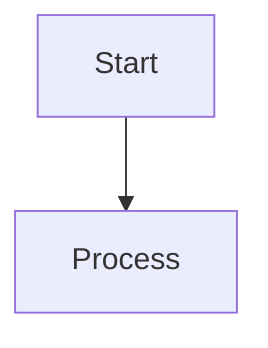

# Obsidian Refiner — Refinement Pipeline

The Refinement pipeline operates in two modes depending on the condition of the target note:
1. **Decouple Mode (Decomposition)**: Applied to monolithic notes. Splits the monolith into an index-based Hub note and multiple atomic Spoke notes (target ~40 lines).
2. **Reformat & Enrich Mode (Restructuring)**: Applied to notes that are empty, too lean (< 600 characters), or badly formatted (especially YAML frontmatter tags). Re-styles the note, corrects metadata schemas, and enriches content with authoritative definitions.

## Inputs

- `<TARGET_NOTE>` — path to the note to refactor or reformat/enrich.
- `<PARENT_FOLDER>` — parent folder where the new notes/re-formatted note will reside.
- `<HUB_NAME>` — the primary Hub note that this note should link back to.

## Required Tools

This skill requires:
- **`web_search` & `web_extract`** (native tools or programmatically imported via `hermes_tools`) to locate authoritative definitions, formulas, and academic context.
- **`write_file` & `patch`** (native file operation tools) to commit updates to the vault.

## Differences from obsidian-injector

### In Decouple Mode:
- **Phase 1**: Parse the monolith's headings as candidate concepts (skip `find` step).
- **Phase 2**: Router maps concepts. The monolith itself matches the H1 title (which becomes the Hub).
- **Phase 3**: Write Spokes first (atomically, with `[[Hub title]]` link), then overwrite the Hub note with the Spoke index.

### In Reformat & Enrich Mode:
- **Phase 1**: Inspect the note's frontmatter and body. Check if the note is empty or contains **fewer than 600 characters** (< 600 chars).
- **Phase 2**: Check for missing context, empty bodies, and badly formatted YAML tags (e.g. camelCase, uppercase, spaces, or missing values).
- **Phase 3**: Reformat the YAML frontmatter (lowercase, hyphen-separated tags). If the content is too lean or empty, perform `web_search`/`web_extract` to retrieve factual, academic definitions and write a formal Italian body. Overwrite the target note with the polished, enriched version.

## Content Preservation & Deletion Rules

- **Enrichment Trigger**: Any note containing **fewer than 600 characters** (< 600 chars) must be actively enriched and restructured.
- **Anti-Deletion Policy**: Deleting existing information is **strictly discouraged** unless:
  1. The information is pure semantic/formatting noise.
  2. The model is rewriting/expanding that same concept in a more thorough, detailed, and academically rigorous manner.
  3. The model has verified via `web_search` that the original phrase, definition, or formula is factually incorrect.

## Hub/Target Note Rewrite Constraint

Hub rewrites use full `write_file`, never `patch`. This is the one case
where the Router overwrites existing content. The original monolith body
is preserved in the Spokes; only the Hub structure changes.

## External Enrichment (Optional)

If a concept within the target note is underspecified or requires formal formulas, standard academic definitions, or illustrative examples to be fully usable:
- **Do** leverage the native `web_search` and `web_extract` tools to retrieve authoritative reference materials.
- **Do not** introduce speculative or unverified claims. Ensure all fetched information is factually accurate, structured for academic readability, and integrated cleanly into the Spoke's Italian body text.

---

## Scripts & Tools

The mechanical operations of the Refiner are driven by scripts inside `<REFINER_SCRIPTS_DIR>`:
- `scripts/inspect_note.py` — Phase 1 tool. Diagnoses note size, metrics, and frontmatter/tag formatting. Run via `execute_code`: `python3 <REFINER_SCRIPTS_DIR>/inspect_note.py --note "<PATH_TO_NOTE>" [--out "<OUT_JSON>"]`
- `scripts/split_monolith.py` — Phase 2/3 Decouple mode planner. Parses H2 headings and generates operations for the bulk writer: `python3 <REFINER_SCRIPTS_DIR>/split_monolith.py --note "<PATH_TO_NOTE>" --parent-folder "<PARENT_FOLDER>" --hub "<HUB_NAME>" --out "<OUT_OPS_JSON>"`
- `scripts/normalize_frontmatter.py` — Phase 3 Reformat mode planner. Deterministically normalizes frontmatter tags: `python3 <REFINER_SCRIPTS_DIR>/normalize_frontmatter.py --note "<PATH_TO_NOTE>" [--write | --out "<OUT_OPS_JSON>"]`
- `<COMMON_DIR>/bulk_writer.py` — Phase 3 bulk mutation executor. Applied to decoupling splits or frontmatter normalizations.
- `<COMMON_DIR>/linter.py` — Phase 4 validator. Checks for wikilinks and atomicity constraints.

---

## Web Enrichment (`web_search` + `web_extract`)

Invoked **only in Reformat & Enrich mode**, and only when `inspect_note.py` reports the
target as empty, lean (`is_lean: true`, < 600 chars), or when anti-deletion rule #3
requires verifying a definition/formula before rewriting it. Decouple mode and
deterministic YAML normalization never call the web.

### Tool contract (native Hermes `web` toolset)
- `web_search(query)` — ranked results via the configured `web.search_backend`. Responses
  carry a success envelope; on `{"success": false}` or empty results, **do not fabricate** —
  proceed with the note's existing content plus the deterministic Reformat fixes only.
- `web_extract(url[, ...])` — readable content from one or more URLs via `web.extract_backend`.
  Prefer extracting the top 1–3 authoritative results (official docs, papers, standards)
  over relying on search snippets.

### Backend requirement (hard)
`web_extract` needs an extract-capable backend: `firecrawl`, `tavily`, `exa`, or `parallel`.
`searxng` is **search-only** and returns a "search-only backend" error on extract. If extract
is unavailable, **degrade gracefully**: fall back to `web_search` snippets for the body and
still apply the deterministic Reformat fixes (frontmatter normalization, OFM restyle). Never
block a reformat because extraction is unconfigured.

### Phase 2 flow (Reformat & Enrich)
1. `web_search` the note title + domain context (e.g. `"Backpropagation reti neurali"`).
2. `web_extract` the best authoritative URLs; pull definitions, formulas, examples.
3. Synthesize a formal Italian body, **preserving** all existing factual content
   (anti-deletion policy). Set `AI: true` in frontmatter.
4. Validate via `<COMMON_DIR>/linter.py`.

---

## Obsidian Flavored Markdown (OFM) Styling Instructions

Notes must be created and edited using valid Obsidian Flavored Markdown. This section outlines the structural syntax extensions to be utilized:

### 1. Frontmatter & Properties (YAML)
Every note must start with a YAML frontmatter block containing key metadata properties.
- **`tags`**: Note tags (always lowercase and hyphen-separated, e.g. `machine-learning`).
- **`aliases`**: Alternative names for the note.
- **`cssclasses`**: Style classes if needed.
See [PROPERTIES.md](references/PROPERTIES.md) for full types and details.

### 2. Internal Links (Wikilinks)
Use `[[wikilinks]]` for internal notes.
```markdown
[[Note Name]]                          Link to note
[[Note Name|Display Text]]             Custom display text
[[Note Name#Heading]]                  Link to heading
[[Note Name#^block-id]]                Link to block
```

### 3. Embeds
Prefix any wikilink with `!` to embed its content inline:
```markdown
![[Note Name]]                         Embed full note
![[Note Name#Heading]]                 Embed section
![[image.png]]                         Embed image
```
See [EMBEDS.md](references/EMBEDS.md) for PDF, audio, and query embeds.

### 4. Callouts
Use callouts for structured callouts and tips:
```markdown
> [!note]
> Basic callout.

> [!tip] Scholarly Tip
> Helpful hint or context.
```
Common types: `note`, `tip`, `warning`, `info`, `example`, `quote`, `bug`, `danger`, `question`.
See [CALLOUTS.md](references/CALLOUTS.md) for details on folding and type lists.

### 5. Math (LaTeX)
Use LaTeX math blocks for equations:
```markdown
Inline: $e^{i\pi} + 1 = 0$

Block:
$$
\frac{a}{b} = c
$$
```

### 6. Diagrams (Mermaid)
Use Mermaid code blocks for rendering relationships:


---

## Pitfalls

- **Spoke linkback** — every Spoke must contain `[[Hub Title]]` in the
  body (not frontmatter). The Phase 3 validator enforces this.
- **No orphans** — never create a Spoke without updating the Hub's index.
  Order operations: write all Spokes first, then rewrite the Hub last with
  the complete Spoke list.
- **Atomicity** — if a Spoke would exceed 40 lines, split further (sub-Spoke
  or sub-section). Do not loosen the limit.
